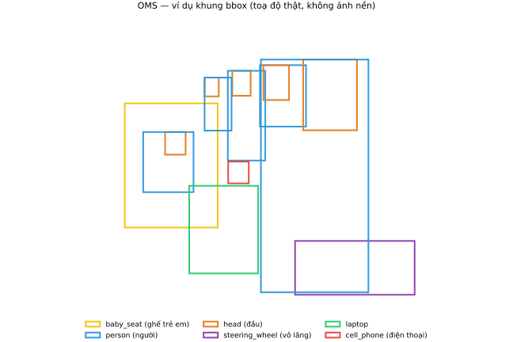
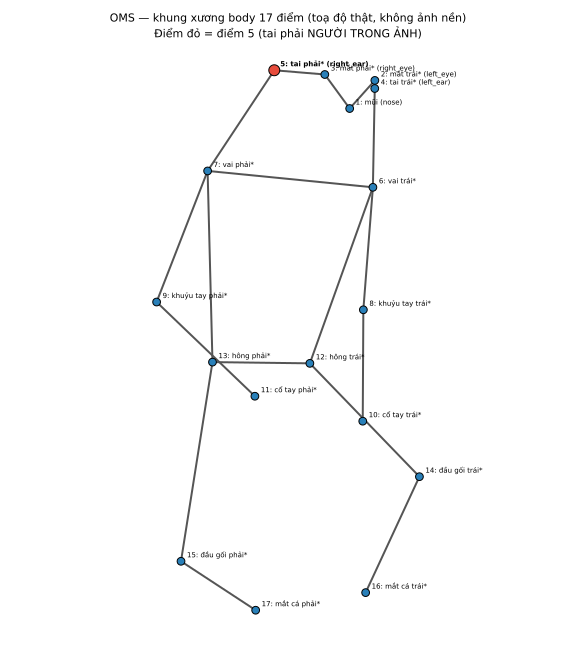
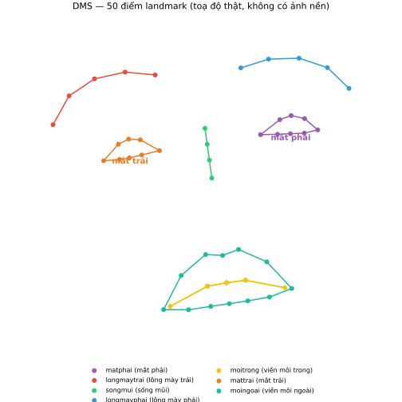

# LABEL_GUIDELINE.md — Quy tắc gán nhãn chi tiết cho DMS và OMS

> Tài liệu này bổ sung cho [GUIDE.md](GUIDE.md) — đọc GUIDE.md trước để biết cách đăng nhập, tìm
> task, lưu bài. Tài liệu này tập trung vào **quy tắc gán nhãn chính xác** cho từng lớp nhãn và
> **chiều trái/phải** — phần dễ gây nhầm lẫn nhất giữa 2 task.

## ⚠️ Lưu ý quan trọng nhất: DMS và OMS dùng CHIỀU TRÁI/PHẢI NGƯỢC NHAU

Đây là lỗi phổ biến nhất nếu không đọc kỹ — hai task dùng hai quy ước hoàn toàn khác nhau:

| Task | Quy ước chiều | Ý nghĩa |
|---|---|---|
| **OMS** (bbox + tư thế `body`) | Theo **góc nhìn của người trong ảnh** | Trái/phải tính theo cơ thể người được gán, giống như bạn đang đứng đối diện họ |
| **DMS** (50 điểm khuôn mặt) | Theo **chiều của bức ảnh** | Trái/phải tính theo vị trí thực tế trên màn hình, không tưởng tượng đổi chỗ |

Xem giải thích chi tiết và ví dụ cụ thể ở từng phần bên dưới.

---

## Phần 1 — Task OMS: chỉ gán các lớp sau

OMS có nhiều lớp nhãn hơn số lượng thực sự cần dùng. **Chỉ gán 8 lớp sau, bỏ qua tất cả lớp khác
xuất hiện trong danh sách nhãn** (`infant`, `food`, `cigarette`, `bag`, `baby_seat_forward`,
`baby_seat_backward`, `baby_doll` — **không dùng** các lớp này):

### Hình chữ nhật (rectangle) — 6 lớp

| Lớp | Gán cho |
|---|---|
| `person` | Mỗi người trong xe (**kể cả em bé búp bê ngồi trên ghế trẻ em — vẫn gán là `person`**, không dùng lớp `baby_doll` hay `infant` riêng) |
| `head` | Đầu của mỗi người đã gán `person` |
| `baby_seat` | Ghế ngồi trẻ em (ghế an toàn cho trẻ nhỏ) |
| `cell_phone` | Điện thoại di động nếu xuất hiện trong ảnh |
| `steering_wheel` | Vô lăng |
| `laptop` | Laptop/màn hình/thiết bị dạng tương tự nếu xuất hiện |

**Quy tắc bắt buộc:**
- **Không gán người ở NGOÀI xe** (người đi đường, người ngoài cửa sổ nhìn thấy qua kính xe) — chỉ
  gán người **ngồi trong xe**.
- Vẽ khung ôm sát đúng vật thể, không để dư viền.

**Sơ đồ minh hoạ** (toạ độ khung thật lấy từ một khung hình đã gán nhãn thật, vẽ lại trên nền
trắng — không phải ảnh chụp thật):

### Khung xương (skeleton) `body` — chỉ gán cho tài xế

- **Chỉ gán tư thế `body` cho TÀI XẾ** (người ngồi ở vị trí lái xe) — **không gán pose cho hành
  khách khác**, kể cả khi họ xuất hiện rõ trong ảnh.
- 17 điểm theo đúng thứ tự khung xương có sẵn (mũi, mắt, tai, vai, khuỷu tay, cổ tay, hông, đầu
  gối, mắt cá chân).

### Mask `seat_belt`

- Tô đúng vùng dây an toàn nhìn thấy được trên người tài xế (và hành khách khác nếu nhìn rõ dây
  an toàn của họ).

### ⚠️ Chiều gán cho OMS: theo góc nhìn của NGƯỜI TRONG ẢNH

Khi gán khung xương `body`, trái/phải được tính **theo chính cơ thể người trong ảnh**, giống như
bạn đang đứng đối diện và nhìn họ (như nhìn gương) — **không phải theo chiều bạn nhìn màn hình**.

**Ví dụ cụ thể:** điểm số 5 trong 17 điểm khung xương là **tai phải của người trong ảnh**. Vì
người đó quay mặt về phía camera, tai phải của họ (theo cơ thể họ) lại xuất hiện ở **phía bên
trái của bức ảnh** khi bạn nhìn lên màn hình. Đây là điều bình thường, không phải lỗi — hãy tưởng
tượng bạn đang bắt tay hoặc đối mặt trực tiếp với người đó, "phải" và "trái" luôn tính theo họ.

Áp dụng quy tắc này cho **tất cả các điểm có "trái"/"phải"** trong 17 điểm (mắt, tai, vai, khuỷu
tay, cổ tay, hông, đầu gối, mắt cá chân) — luôn theo cơ thể người được gán, không theo màn hình.

**Sơ đồ minh hoạ** (toạ độ thật lấy từ một khung hình đã gán nhãn thật, vẽ lại trên nền trắng —
không phải ảnh chụp thật, không có gương mặt/người thật nào trong hình): điểm đỏ là điểm số 5,
chú ý nó nằm ở phía **bên trái của sơ đồ**:

---

## Phần 2 — Task DMS: 50 điểm landmark khuôn mặt

7 nhóm khung xương, tổng 50 điểm (xem thêm [GUIDE.md](GUIDE.md) bước 3):

`longmaytrai` (lông mày trái), `longmayphai` (lông mày phải), `songmui` (sống mũi), `mattrai`
(mắt trái), `matphai` (mắt phải), `moingoai` (viền môi ngoài), `moitrong` (viền môi trong).

### ⚠️ Chiều gán cho DMS: theo chiều của BỨC ẢNH (ngược lại với OMS!)

Khác với OMS, DMS gán theo **đúng vị trí trên màn hình**, không tưởng tượng đổi chỗ theo góc nhìn
của người trong ảnh.

**Ví dụ cụ thể:** nhóm `matphai` ("mắt phải") phải được đặt tại con mắt nằm ở **phía bên phải của
bức ảnh** — đúng như bạn nhìn thấy trên màn hình. Nhóm `mattrai` ("mắt trái") đặt tại con mắt nằm
ở **phía bên trái của bức ảnh**. **Không** áp dụng quy tắc "đối diện/soi gương" như task OMS.

Nói ngắn gọn: cứ nhìn thẳng vào màn hình, nhãn tên gì thì đặt đúng vị trí đó trên ảnh — không cần
suy luận thêm.

**Sơ đồ minh hoạ** (toạ độ 50 điểm thật lấy từ một khung hình đã gán nhãn thật, vẽ lại trên nền
trắng — không phải ảnh chụp thật, không có gương mặt người thật nào trong hình): chú ý nhóm
`mattrai` (mắt trái) nằm bên **trái sơ đồ**, nhóm `matphai` (mắt phải) nằm bên **phải sơ đồ**:

---

## Bảng tóm tắt để tránh nhầm lẫn

| | OMS (`body`) | DMS (50 điểm mặt) |
|---|---|---|
| Trái/phải tính theo | Cơ thể người trong ảnh (như soi gương) | Vị trí thực tế trên ảnh (như bạn nhìn thấy) |
| Ví dụ | Điểm "tai phải" → nằm bên **trái** ảnh | Nhóm "mắt phải" (`matphai`) → nằm bên **phải** ảnh |

Nếu không chắc chắn khi đang gán, dừng lại và đọc lại bảng này trước khi đặt điểm — đặt sai chiều
hàng loạt sẽ phải sửa lại toàn bộ ảnh đã làm.
